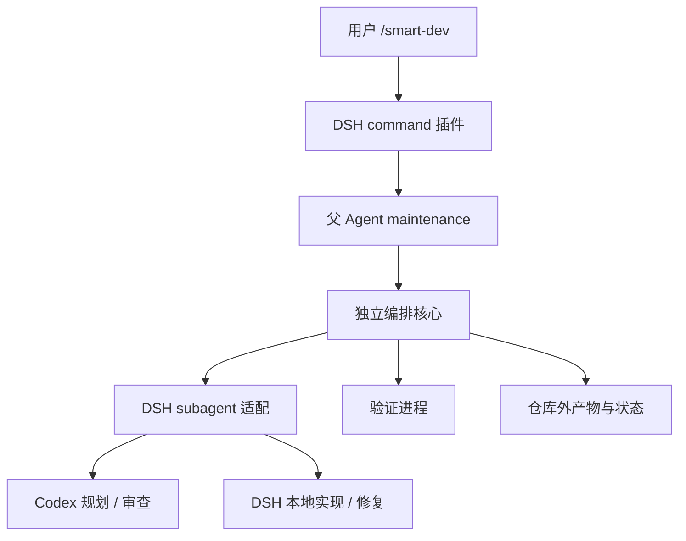

# 当前架构



## 分层

`src/core` 只通过 `Ports` 使用 `invoke`、`verify`、`evidence`、`save`、`progress`。`src/dsh` 连接命令和子 Agent，`src/host` 实现本地副作用。未来可以复用策略语义、产物协议与测试；跨语言迁移仍需移植实现。

`/smart-dev` 是人类命令，不依赖模型生成 workflow 脚本。命令在父 Agent 的 `runMaintenance()` 中执行，已有活跃任务会拒绝占用，后续输入留在 inbox。其他会话或外部工具仍可能修改同一仓库，因此应使用独立 worktree。

## 状态与预算

```text
PLAN → EXECUTE → VERIFY → REVIEW → DONE
                   ↑        │
                   └─ FIX ←─┘
VERIFY → NEEDS_REVIEW（没有审查预算）
异常 → FAILED；取消 → CANCELLED
```

- `maxStrongCalls` 计量 Planner/Reviewer 启动尝试，与 provider 注册别名无关。启动前落盘；失败尝试也计数。
- 默认 2 次：Plan + Review。修复后再次验证并返回 `NEEDS_REVIEW`，不会默认通过。
- 3 次允许一次修复后复核；更多修复需要相应增加预算。`maxFixRounds` 默认 1，0 禁止修复。
- `DONE` 要求非空验证集全部退出码为 0、没有超时/取消/截断标记，且最新审查为无未解决 issues 的 `PASS`。
- 产物在本地严格校验。外部 provider 不一定支持结构化输出，因此不强传 `outputSchema`。

`NEEDS_REVIEW` 表示最新改动没有获得审查，最新测试也可能仍失败；必须看验证证据。当前没有续跑命令，不能在脏目录重新执行全流程来代替恢复。

## 子 Agent 生命周期

适配器调用 `ctx.subagents.start(provider, {parent, prompt, signal, ...})`，读取 `run.result`，始终等待 `run.dispose()`。非 `completed` 结果不能作为成功。启动期间的取消由 provider 负责回收未发布资源。

Worker 固定显式模型、工具 allowlist 和绝对委派深度上限 1；backend 必须声明对应能力。目前支持的路径为 `spawn`；不能只改名称就声称 Claude Code Worker 支持相同限制。

取消、超时、插件卸载向子 Agent 传递信号。卸载先撤销命令，再等待在途操作清理。若 child disposal 抛错，保留锁供人工检查。若 provider 不响应启动取消或永不完成 disposal，插件可能等待；不会在已知子任务未清理时继续派遣写者。

## Workspace 与 Git

目标须为有 HEAD 的干净 Git worktree 根目录；包含未跟踪文件的脏状态也拒绝。规范化真实路径后，以路径 SHA-256 在 `stateRoot/locks` 建立原子目录锁。多个实例必须共享同一 stateRoot。

证据采集使用临时 index：读入 HEAD，加入非忽略文件，生成 binary patch，包含新增文件，不改用户 staging。指纹包括 HEAD、分支、status、真实 staging diff 和工作树 patch，用于检测 Planner/Reviewer 的可见修改。

这是事后检测，不覆盖忽略文件、仓库外写入、写后恢复及所有 Git 管理状态。Submodule 内部改动也不等于完整可移植补丁。失败保留改动，不自动回滚。

## 验证进程

命令来自受信任宿主配置，以 argv 运行，无 shell 展开。它们是宿主进程，**不经过 DSH 工具权限审批**；不能把模型生成内容直接放入验证配置。POSIX 取消终止进程组，主动脱离进程组的后台进程不在保证范围内。默认单条验证输出最多 2 MB，超限即失败。

## 产物与恢复

默认 `${XDG_STATE_HOME:-~/.local/state}/harness-orchestrator/runs/<uuid>/`：

```text
config.json / policy.json / task.txt
state.json                      最新阶段与预算
event-*.json                    阶段变化
*-planner.prompt.txt / *.result.json / *.error.txt
plan.json
verification-<round>.json
changes-<round>.patch
review-<round>.json
final.patch                     仅 DONE
last.patch                      正常清理后的最终改动，包括失败/取消
error.txt / snapshot.error.txt
```

文本与 JSON 通过临时文件加 rename 写入，新目录权限 0700、文件 0600。原子替换不等于跨文件事务或断电级 fsync 保证。进程崩溃可能留下非终态和锁；不会自动恢复/重放。

计划需有 summary、risk、非空且 ID 唯一的 tasks，每项含 description 和非空 acceptance。审查需 decision、summary、issues；issue 含 severity、problem。额外字段用于文件位置、建议等。单个结构化产物最多 256000 字符，审查 patch 最多 120000 字符；超限明确失败，保留证据。

记录是编排轨迹，不是完整后端 trace。没有 token/cost 归一化，预算只覆盖插件直接启动的强模型角色。
