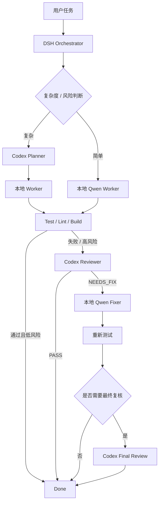
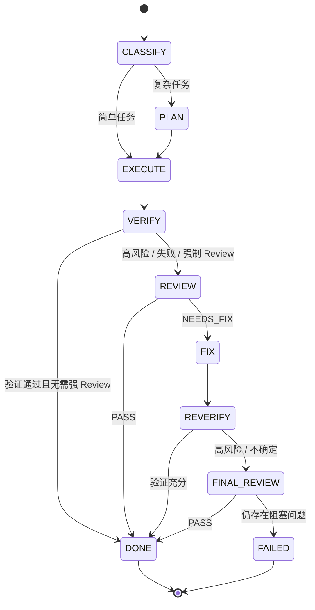
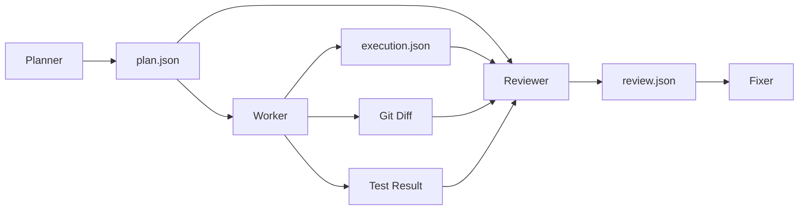
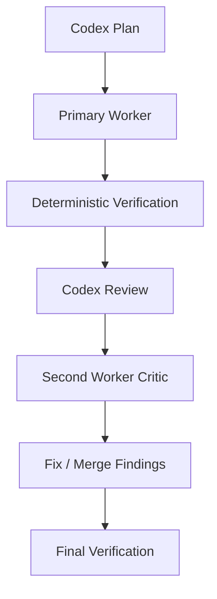
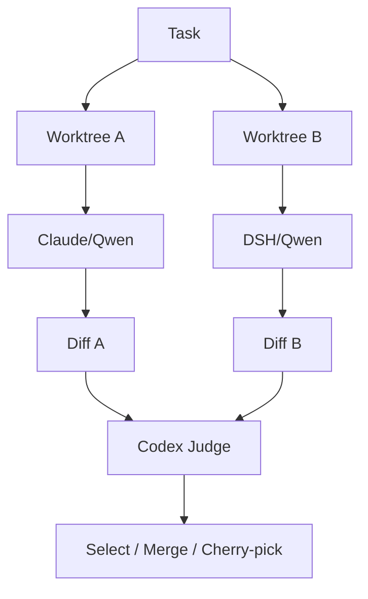
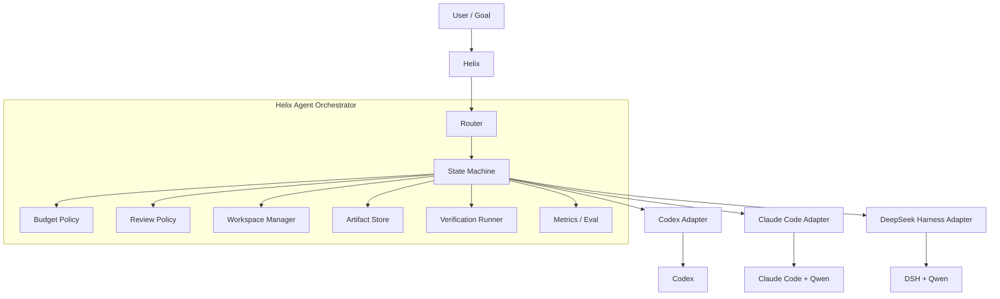
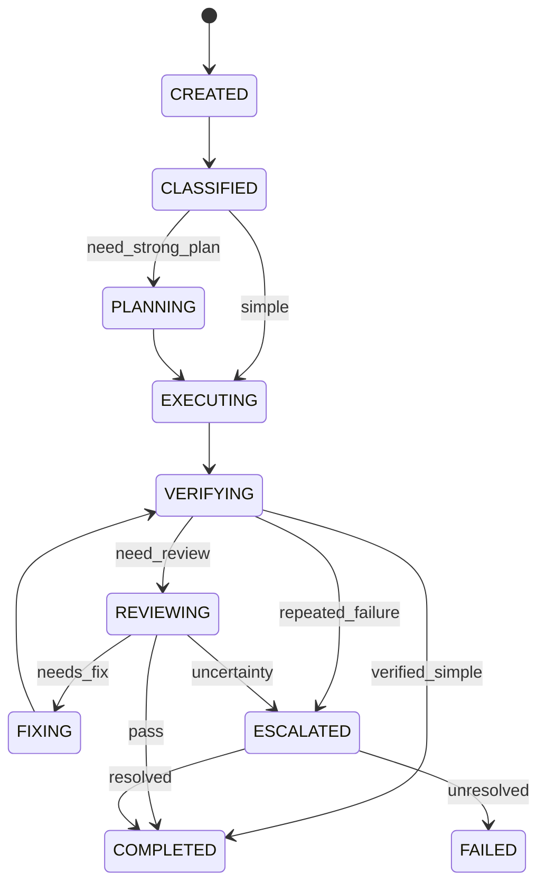
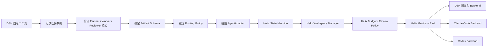

> **历史设计草案，已归档。** 本文保留原始讨论，不代表当前实现或已验证能力。当前路线 A 为 DSH 插件，见 [ADR-001](../decisions/001-dsh-plugin.md) 和 [当前架构](../architecture.md)。文中的 /smart-dev 以当前使用指南为准；模型比较、成本收益及长期能力仍需实测。

# Codex + Claude Code + DeepSeek Harness 多 Agent 编排方案

> **文档版本**：v1.0
> **日期**：2026-09-16
> **适用环境**：Codex + Claude Code + DeepSeek Harness + 本地 Qwen3.8-27B
> **核心目标**：让昂贵、能力最强的 Codex 主要负责高价值的“规划 / 推理 / 复核”，让本地 Qwen 驱动的 Claude Code 或 DeepSeek Harness 承担大部分代码执行，从而在开发质量、成本和吞吐之间取得更好的平衡。

---

## 1. 背景与问题定义

当前开发环境中存在三类 Agent / Harness：

- **Codex**：模型能力最强，复杂代码理解、架构设计、疑难问题分析和代码 Review 能力最好，但使用成本最高。
- **Claude Code + 本地 Qwen3.8-27B**：主要消耗本地推理资源，适合承担代码搜索、实现、修改、测试和一般性调试任务。
- **DeepSeek Harness + 本地 Qwen3.8-27B**：同样使用本地模型，但 Harness 本身更偏向可组合 Agent Runtime，具有 subagent、workflow、session、trace 等能力，适合作为多 Agent 编排的基础设施。

如果所有任务都直接交给 Codex，质量高但成本过大；如果所有任务都交给本地 27B 模型，复杂任务的规划、长期一致性和最终代码质量又可能不足。

因此希望形成如下分工：

```text
Codex：思考 / 规划 / 架构 / 难题分析 / 最终 Review

Claude Code / DSH + Qwen：
代码搜索 / 文件修改 / 实现 / 跑测试 / 机械重构 / 根据 Review 修复
```

理想闭环为：

```text
任务
  ↓
Codex Planner
  ↓
本地 Worker 执行
  ↓
自动测试 / lint / build
  ↓
Codex Reviewer
  ↓
如果存在问题 → 本地 Worker 修复
  ↓
再次验证
  ↓
完成
```

但不能简单地让 Agent 互相无限调用，否则会出现：

1. Codex 调用次数失控；
2. 多 Agent 同时修改同一 Workspace，产生冲突；
3. Agent 之间依赖隐式对话上下文，任务不可复现；
4. Review → Fix → Review 无限循环；
5. 本地模型在复杂编排中逐渐偏离原始目标；
6. 无法衡量不同 Harness 在不同任务类型上的实际表现。

因此整体原则应当是：

> **LLM 决定“内容”，状态机决定“流程”。**

---

# 2. 总体推荐

推荐分为两条连续路线。

| 路线 | 定位 | 当前优先级 | 开发成本 | 长期价值 |
|---|---|---:|---:|---:|
| **路线 A：DeepSeek Harness 作为总控** | 低成本快速验证工作流 | ★★★★★ | 低 | 高 |
| **路线 B：Helix Thin Orchestrator** | 将验证后的调度能力沉淀为自己的产品核心 | ★★★★☆ | 中 | ★★★★★ |

两条路线不是二选一，而是：

```text
路线 A：验证
     ↓
收集真实数据
     ↓
沉淀接口 / 策略 / Artifact
     ↓
路线 B：产品化
```

推荐执行顺序：

```text
现在
  ↓
DeepSeek Harness PoC
  ↓
真实使用 2~4 周
  ↓
分析任务成功率 / Codex 调用量 / Worker 表现
  ↓
确认编排模式确实有效
  ↓
抽象成 Helix AgentOrchestrator
```

---

# 3. 路线 A：以 DeepSeek Harness 为总控

## 3.1 路线定位

DeepSeek Harness 本身已经具备较完整的 subagent 抽象，可以让一个父 Agent 同时使用不同类型的子 Agent。

当前官方实现支持的 backend 包括：

```text
ctx.subagents
├── spawn-in-process
├── fork-in-process
├── ACP
├── Codex
├── Claude Code
└── DSH SDK
```

其中 Codex 和 Claude Code 是独立的一等 provider，可与本地 DSH Agent 同时存在。

这使得 DSH 非常适合作为第一阶段的统一编排入口：



---

## 3.2 为什么优先选择 DeepSeek Harness

### 3.2.1 已经具备真正的 Harness Router 基础

这里需要区分两个概念：

```text
Model Router
vs
Harness Router
```

Model Router 只是：

```text
GPT / Claude / Qwen / DeepSeek
```

之间切模型。

而实际希望保留的是不同 Coding Agent 自己的行为：

```text
Codex
├── 自己的 agent loop
├── shell / edit 策略
├── context 管理
├── Codex prompt / skill
└── sandbox / permission 行为

Claude Code
├── Claude Code agent loop
├── CLAUDE.md
├── tools
├── hooks
└── permission system

DeepSeek Harness
├── profile / composition
├── service seam
├── session
├── workflow
└── subagent
```

因此真正需要的是：

> **Harness Router，而不仅仅是 Model Router。**

DSH 当前已经直接提供 Codex / Claude Code provider，因此非常符合这一目标。

---

## 3.3 第一阶段最小实现

建议不要一开始设计通用 Agent Framework。

先实现一个固定命令，例如：

```text
/architect
```

或：

```text
/smart-dev
```

执行固定状态机：



初期强烈建议限制：

```text
max_codex_calls = 2
max_fix_rounds = 2
single_writer = true
reviewer_write = false
parallel_write = false
```

解释：

- `max_codex_calls = 2`：通常只允许 Planner + Reviewer。
- `max_fix_rounds = 2`：避免无限循环。
- `single_writer = true`：同一时刻只有一个 Worker 可以修改主工作区。
- `reviewer_write = false`：Reviewer 只输出 Review，不直接偷偷改代码。
- `parallel_write = false`：第一阶段不要同时让多个 Agent 写同一个目录。

---

# 4. Agent 角色划分

## 4.1 Codex Planner

Codex Planner 的职责不是写大量代码，而是：

- 理解用户目标；
- 阅读关键模块；
- 判断影响范围；
- 找出主要风险；
- 设计实现顺序；
- 给出 acceptance criteria；
- 给 Worker 足够明确、但不过度冗长的任务描述。

Planner 输出推荐采用结构化 Artifact。

### `plan.json`

```json
{
  "summary": "Implement persistent agent session storage",
  "risk": "high",
  "assumptions": [],
  "tasks": [
    {
      "id": "T1",
      "description": "Add persistent session repository",
      "files": [
        "src/session/**"
      ],
      "dependencies": [],
      "acceptance": [
        "session survives process restart",
        "existing session API remains backward compatible"
      ]
    }
  ],
  "verification": [
    "unit tests",
    "restart persistence test",
    "existing integration tests"
  ]
}
```

Planner 不应该直接把几十页自然语言 conversation 传给 Worker。

应该传：

```text
repo + plan.json + 必要上下文
```

---

## 4.2 Worker

Worker 可以有两个候选 Harness：

```text
Worker A = Claude Code + Qwen3.8-27B
Worker B = DeepSeek Harness + Qwen3.8-27B
```

注意：两个 Worker 使用的是同一个底层模型，因此不要默认把相同任务并行发给二者。

差异主要来自 Harness：

- system prompt；
- agent loop；
- 文件搜索方式；
- edit 策略；
- shell 使用习惯；
- context compression；
- stop 条件；
- tool schema。

因此正确方式应该是：

```text
Router
  ├── Claude Code Worker
  └── DSH Worker
```

每个任务默认只选择一个。

长期根据历史数据建立 Harness Router。

---

## 4.3 Codex Reviewer

Reviewer 应该只看：

```text
原始目标
+ plan.json
+ git diff
+ tests / lint / build 结果
+ 必要源码
```

而不是直接继承 Planner 的所有隐式思考上下文。

Reviewer 输出：

### `review.json`

```json
{
  "decision": "NEEDS_FIX",
  "confidence": 0.92,
  "issues": [
    {
      "severity": "high",
      "file": "src/session/store.ts",
      "line": 132,
      "problem": "transaction is not committed atomically",
      "impact": "partial session state can be persisted after crash",
      "suggestion": "wrap metadata and message writes in the same transaction"
    }
  ],
  "missing_tests": [
    "crash between metadata and message persistence"
  ]
}
```

Reviewer 的目标不是重新实现，而是：

> 找 bug、判断是否满足目标、补充遗漏的验证条件。

---

## 4.4 Fixer

Fixer 使用本地 Qwen。

输入：

```text
repo
+ review.json
+ 当前 test results
```

Fixer 尽量不要重新做完整规划。

提示原则：

```text
只修复 review 中已经确认的问题。
除非必须，不进行额外重构。
完成后运行指定验证。
```

这样可以避免 Fix 阶段再次扩大 scope。

---

# 5. Agent 之间使用 Artifact，而不是共享长对话

这是整个系统最重要的设计原则之一。

不推荐：

```text
Codex conversation
        ↓
完整历史塞给 Qwen
        ↓
完整历史再塞给 Codex
```

推荐：



这样带来几个好处：

1. 降低 Qwen context 压力；
2. Agent 可以随时替换；
3. 整个流程可回放；
4. 方便做 eval；
5. 易于排查哪个阶段出了问题；
6. 后续 Helix 可以直接复用同一套 Artifact Protocol。

---

# 6. 推荐的标准 Artifact

## 6.1 Task Artifact

```json
{
  "task_id": "T-20260916-001",
  "goal": "...",
  "constraints": [],
  "priority": "normal",
  "risk": "medium"
}
```

## 6.2 Plan Artifact

```json
{
  "task_id": "T-20260916-001",
  "summary": "...",
  "risk": "medium",
  "tasks": [],
  "verification": []
}
```

## 6.3 Execution Artifact

```json
{
  "worker": "claude-code-qwen",
  "tasks_completed": ["T1", "T2"],
  "files_changed": [],
  "commands": [],
  "tests": {
    "passed": 53,
    "failed": 0
  },
  "commit": "optional-sha"
}
```

## 6.4 Review Artifact

```json
{
  "reviewer": "codex",
  "decision": "PASS",
  "confidence": 0.95,
  "issues": [],
  "missing_tests": []
}
```

## 6.5 Final Result

```json
{
  "status": "DONE",
  "codex_calls": 2,
  "worker": "dsh-qwen",
  "fix_rounds": 1,
  "tests_passed": true,
  "human_intervention": false
}
```

---

# 7. Codex 调度策略

Codex 不应该进入每一个任务。

推荐任务等级如下。

## L0：简单任务

典型任务：

- 文案 / 配置小改动；
- 加日志；
- 加字段；
- 小 UI 调整；
- 补简单单测；
- 非核心代码的机械重构。

流程：

```text
Qwen Worker
   ↓
test / lint
   ↓
DONE
```

Codex 调用：**0 次**。

---

## L1：普通开发任务

例如：

- 单模块 Feature；
- 普通 Bug；
- 一般性 API 修改；
- 中等规模 refactor。

流程：

```text
Qwen Plan
   ↓
Qwen Worker
   ↓
test
   ↓
Qwen Review
```

出现以下情况才升级 Codex：

```text
test fail
review confidence 低
修改范围异常扩大
涉及核心模块
出现多轮失败
```

Codex 调用：通常 **0~1 次**。

---

## L2：复杂任务

例如：

- 跨模块重构；
- Agent Loop；
- Context architecture；
- permission architecture；
- concurrency；
- persistence；
- 难定位问题；
- 大范围接口变更。

流程：

```text
Codex Planner
     ↓
Qwen Worker
     ↓
test
     ↓
Codex Reviewer
     ↓
Qwen Fix
```

Codex 调用：通常 **2 次**。

---

## L3：关键任务

例如：

- 权限与安全；
- 核心 Agent Runtime；
- 数据迁移；
- 强一致性存储；
- 高并发；
- 生产事故修复；
- 大范围不可逆操作。

流程：



第二 Worker 建议主要承担 Critic，而非并行修改。

---

# 8. 单写者原则与 Workspace 策略

第一阶段推荐：

```text
single_writer = true
```

即任何时候只有一个 Agent 能修改当前任务工作区。

如果未来需要多个实现并行比较，使用 Git Worktree：

```text
repo/
├── main
└── .worktrees/
    ├── task-123-worker-a/
    └── task-123-worker-b/
```

流程：



但此模式只建议用于：

- 高风险复杂任务；
- 方案存在明显不确定性；
- 需要比较不同 Harness 表现；
- benchmark / evaluation。

普通任务不要 Best-of-2，否则会浪费本地算力和时间。

---

# 9. DeepSeek Harness 第一阶段具体模块

推荐实现：

```text
smart-dev/
├── classifier
├── orchestrator
├── artifact-store
├── verifier
├── policies
│   ├── complexity-policy
│   ├── codex-budget-policy
│   ├── review-policy
│   └── retry-policy
└── metrics
```

## 9.1 Classifier

输入：

```text
用户任务
repo metadata
影响文件数估计
任务类型
```

输出：

```json
{
  "level": "L2",
  "risk": "high",
  "requires_codex_plan": true,
  "requires_codex_review": true
}
```

第一版甚至可以完全使用规则而不是 LLM。

例如：

```text
触发 L2/L3：
- permission
- auth
- session persistence
- concurrent
- migration
- database schema
- core agent loop
- > 5 modules
- previous attempt failed >= 2
```

规则比“让模型自己决定要不要调用昂贵 Codex”更可控。

---

## 9.2 Verifier

Verifier 必须尽量是 deterministic tools：

```text
unit test
integration test
lint
build
type check
static analysis
custom validation script
```

验证层非常关键，因为多 Agent 系统不能只靠另一个 LLM 说“看起来没问题”。

优先级应该是：

```text
自动测试证据
  > 静态检查
  > Reviewer 判断
  > Worker 自述
```

---

## 9.3 Budget Policy

推荐最开始直接硬编码。

```yaml
codex:
  L0: 0
  L1: 1
  L2: 2
  L3: 2

max_fix_rounds: 2
max_worker_retries: 2
```

后续根据真实统计动态调整。

---

# 10. 路线 A 的 MVP

最小版本不需要做 UI，也不需要做复杂 Router。

只做：

```text
/smart-dev <task>
```

固定执行：

```text
复杂度检测
    ↓
如果 L2/L3：Codex Plan
    ↓
Qwen Worker
    ↓
自动测试
    ↓
如果失败或高风险：Codex Review
    ↓
Qwen Fix
    ↓
最终测试
```

MVP 成功标准：

1. 大部分编码 token 由本地模型消费；
2. Codex 平均每个复杂任务 ≤ 2 次调用；
3. Worker 可以根据 Codex Plan 独立完成任务；
4. Review 可以稳定产出结构化问题；
5. Fix 可以根据 Review 准确修改；
6. 整个执行过程能够回放。

---

# 11. 路线 A 应重点收集的数据

这个阶段的真正目标并不仅仅是“省 Codex token”，而是积累 Router 数据。

推荐记录：

```text
task_id
task_type
complexity
risk
planner
worker_harness
worker_model
reviewer
codex_calls
codex_tokens / cost（如果可获得）
local_tokens
worker_steps
files_changed
test_before
test_after
review_issue_count
fix_rounds
human_intervention
final_success
wall_time
```

特别关注：

### Harness 胜率

```text
Claude Code + Qwen
vs
DSH + Qwen
```

按任务类别统计：

```text
bug fix
feature
refactor
frontend
backend
agent logic
testing
repo understanding
```

最终可能得到类似：

```text
Claude Code + Qwen：
前端修改 / 常规代码编辑更稳定

DSH + Qwen：
复杂工具调用 / 自定义 workflow / 多 Agent 更合适
```

具体结论应以自己的数据为准，而不是预先假设。

---

# 12. 路线 A 的风险

## 风险 1：DSH Parent Agent 自己过度调用 Codex

解决：

```text
Codex 调用权限不交给自由 Agent 决定
→ 由 Policy / State Machine 控制
```

## 风险 2：Planner 输出过长

解决：

```text
Codex → JSON Schema
限制 plan artifact 大小
```

## 风险 3：Worker scope creep

解决：

```text
acceptance criteria
allowed paths
reviewer_write = false
```

## 风险 4：Fix 无限循环

解决：

```text
max_fix_rounds = 2
超过后 FAILED / Human Review
```

## 风险 5：多个 Agent 冲突

解决：

```text
single writer
或 Git worktree isolation
```

---

# 13. 路线 B：在 Helix 中实现 Thin Orchestrator

## 13.1 路线定位

当路线 A 已经证明：

```text
Codex Planner + Local Worker + Codex Reviewer
```

确实能在实际开发中明显降低成本，同时保持质量，就不应继续把真正有价值的调度逻辑只放在 DSH 配置中。

此时应该把稳定下来的能力抽象成 Helix 的核心模块：

> **AgentOrchestrator**

注意，这里不是重新实现 Codex / Claude Code / DeepSeek Harness。

目标是：

> **自己实现编排和策略，复用现有成熟 Harness 作为 Backend。**

---

# 14. Helix 最终架构



最终各 Harness 只是一种 Backend。

Helix 自己掌握：

```text
任务状态
任务拆分
谁负责什么
成本预算
权限
workspace
artifact
验证
review policy
失败升级
历史表现
```

这才是长期技术资产。

---

# 15. Adapter 设计

建议统一：

```ts
interface AgentAdapter {
  capabilities(): AgentCapabilities;

  run(request: AgentRequest): Promise<AgentResult>;

  cancel?(runId: string): Promise<void>;
}
```

例如：

```ts
interface AgentRequest {
  role: "planner" | "worker" | "reviewer" | "critic";
  task: TaskArtifact;
  workspace: WorkspaceRef;
  artifacts: ArtifactRef[];
  outputSchema?: JsonSchema;
  timeout?: number;
}
```

返回：

```ts
interface AgentResult {
  status: "success" | "failed" | "cancelled";
  output?: unknown;
  artifacts?: ArtifactRef[];
  usage?: UsageInfo;
  diagnostics?: Diagnostic[];
}
```

这样后续增加：

```text
Qwen Code
OpenCode
Aider
Gemini CLI
其他 Agent
```

只需要增加 Adapter。

---

# 16. 推荐的 Adapter 后端

## 16.1 Codex Adapter

长期优先使用官方可编程接口，而不是 terminal scraping。

推荐顺序：

```text
Codex SDK
或
Codex App Server
```

App Server 提供双向 JSON-RPC 风格接口，可以用于更细粒度地驱动 Codex Agent。

Codex 在 Helix 中主要承担：

```text
planner
architect
reviewer
judge
escalation agent
```

而不是默认 Worker。

---

## 16.2 Claude Code Adapter

优先：

```text
Claude Agent SDK
```

其次：

```text
Claude Code headless CLI
```

Helix 应把 Claude Code 当完整 Harness，而不是只把它当模型 API。

主要角色：

```text
worker
implementation
repository exploration
fixer
critic
```

---

## 16.3 DeepSeek Harness Adapter

路线 B 中 DSH 不再承担“总控”，而变成一个可调用 Backend。

它仍然非常有价值，因为它本身可以承担：

```text
local Qwen worker
复杂 tool workflow
subagent workflow
批量分析
自定义 Profile 场景
```

这样实现：

```text
路线 A
DSH = Orchestrator + Worker

路线 B
Helix = Orchestrator
DSH = Worker Backend
```

这就是两条路线之间最自然的迁移关系。

---

# 17. Helix State Machine

推荐不要一开始用完全动态 DAG。

第一版固定：



后期再扩展为 Task Graph。

---

# 18. Router 设计

第一版 Router 不建议使用复杂 AI Routing。

可以采用打分：

```text
complexity_score =
  module_count
+ core_module_weight
+ security_weight
+ persistence_weight
+ concurrency_weight
+ migration_weight
+ previous_failure_weight
```

例如：

```text
score <= 2
→ Qwen only

3 <= score <= 5
→ Qwen + optional Codex reviewer

6 <= score <= 8
→ Codex planner + Qwen worker + Codex reviewer

score > 8
→ Codex plan + worker + Codex review + critic
```

长期再引入真实数据：

```text
P(success | task_type, harness, complexity)
```

形成数据驱动 Router。

---

# 19. 成本路由

最终 Router 不应该只看“哪个 Agent 最强”，而应该优化：

```text
Expected Utility
=
成功率
- 成本
- 延迟
- 人工介入概率
```

简单表示：

```text
score(agent) =
    success_probability * quality_weight
  - monetary_cost * cost_weight
  - latency * latency_weight
  - human_intervention_probability * intervention_weight
```

例如：

```text
简单 rename
→ local Qwen

普通 feature
→ local Qwen

跨模块设计
→ Codex Planner + local worker

复杂 bug 且 Worker 连续失败
→ Codex escalation
```

目标不是“尽量不用 Codex”，而是：

> **只在 Codex 边际价值最高的地方使用 Codex。**

---

# 20. Reviewer 与 Worker 的权限隔离

建议 Helix 从第一版就支持 Role Permission。

例如：

| Role | Read | Write | Shell | Git Commit | Expensive Model |
|---|---:|---:|---:|---:|---:|
| Planner | ✓ | ✗ | limited | ✗ | ✓ |
| Worker | ✓ | ✓ | ✓ | optional | normally ✗ |
| Reviewer | ✓ | ✗ | test only | ✗ | ✓ |
| Fixer | ✓ | ✓ | ✓ | optional | ✗ |

这样可以防止：

```text
Reviewer 发现问题
→ 顺手改了一堆代码
→ diff 与 review 失去边界
```

---

# 21. 验证优先于 Agent 共识

多 Agent 很容易出现：

```text
Worker：完成了
Reviewer：看起来没问题
Critic：也认可
```

但代码实际上不能运行。

因此 Helix 应明确 Verification 为一等公民。

推荐：

```text
VerificationEvidence
├── test
├── lint
├── build
├── typecheck
├── benchmark
├── replay
└── domain-specific checks
```

最终完成条件可以定义成：

```text
DONE =
acceptance criteria satisfied
AND
required verification passed
AND
no blocking review findings
```

---

# 22. 可观测性设计

每个任务应该能看到完整 trajectory：

```text
Task #123
│
├── Classifier
│     level: L2
│
├── Codex Planner
│     duration
│     cost
│     plan artifact
│
├── Claude/Qwen Worker
│     tool calls
│     files changed
│     commands
│
├── Verification
│     52 passed
│     1 failed
│
├── Codex Review
│     1 high
│     2 medium
│
├── DSH/Qwen Fixer
│
└── Final Verification
      53 passed
```

长期可以形成 Agent Dashboard：

```text
成功率
平均 Codex 调用
平均修复轮数
按任务类别的 Worker 胜率
人工介入率
平均成本
平均完成时间
```

---

# 23. 路线 B 的长期核心价值

最终真正有价值的并不是：

```text
Helix 能调用 Codex
```

因为任何 Wrapper 都可以做到。

真正有价值的是：

```text
Task Understanding
      ↓
Complexity / Risk Classification
      ↓
Harness + Model Routing
      ↓
Execution
      ↓
Deterministic Verification
      ↓
Review / Escalation
      ↓
Historical Feedback
      ↓
Better Routing
```

最终 Helix 可以逐渐形成：

> **Coding Agent Meta-Orchestrator**

即：不与 Codex / Claude Code / DSH 直接竞争，而是在它们之上选择谁最适合当前任务。

---

# 24. 为什么不推荐直接从路线 B 开始

如果现在就实现完整 Helix Orchestrator，会遇到一个问题：

很多设计仍然只是猜测。

例如：

- 哪些任务真的需要 Codex Plan？
- 哪些任务只需要 Codex Review？
- Claude Code + Qwen 与 DSH + Qwen 到底谁更适合什么？
- 27B 本地模型一次 Fix 成功率多少？
- Review 结果采用 JSON 是否足够？
- Planner Artifact 应包含多少源码上下文？
- 两轮 Fix 是否足够？

这些问题最好的答案不是继续设计，而是：

> **跑真实任务。**

因此路线 A 的核心作用就是帮路线 B 产生真实数据。

---

# 25. 两条路线的迁移关系



其中可直接复用的资产：

```text
plan.json schema
review.json schema
execution.json schema
任务等级规则
Codex Budget Policy
Retry Policy
Verification Policy
Worker benchmark 数据
```

因此路线 A 的投入不会浪费。

---

# 26. 建议实施阶段

## Phase 0：人工模拟

先不写代码。

人工执行 10~20 个真实任务：

```text
Codex Plan
→ Qwen Worker
→ test
→ Codex Review
→ Qwen Fix
```

观察：

- Plan 是否真的提高成功率；
- Review 是否真的发现本地模型遗漏；
- Fix 是否能根据 Review 收敛；
- Codex 2 次调用是否足够。

---

## Phase 1：DSH 固定状态机

实现：

```text
/smart-dev
```

只支持：

```text
PLAN
EXECUTE
VERIFY
REVIEW
FIX
```

不做复杂 Router。

---

## Phase 2：引入任务等级

加入：

```text
L0
L1
L2
L3
```

开始跳过不必要的 Codex 调用。

---

## Phase 3：Worker Benchmark

同类任务交替使用：

```text
Claude Code + Qwen
DSH + Qwen
```

统计结果。

形成第一版 Harness Router。

---

## Phase 4：Artifact 固化

正式确定：

```text
Task
Plan
Execution
Review
Verification
FinalResult
```

Schema。

此时已经具备向 Helix 迁移的基础。

---

## Phase 5：Helix Thin Orchestrator

只迁移：

```text
Router
StateMachine
ArtifactStore
WorkspaceManager
Verifier
Policies
Metrics
```

不要迁移具体 Agent Loop。

---

## Phase 6：高级能力

以后再做：

```text
并行 Worktree
Best-of-N
Worker Critic
动态 Task DAG
历史成功率 Router
预算自适应
自动回滚
Human Approval Gate
PR / GitHub Integration
长期 Agent Evaluation
```

---

# 27. 推荐的第一版 Policy

```yaml
routing:
  L0:
    planner: local
    worker: local
    reviewer: none

  L1:
    planner: local
    worker: local
    reviewer: local
    escalate_on_failure: codex

  L2:
    planner: codex
    worker: local
    reviewer: codex

  L3:
    planner: codex
    worker: local
    reviewer: codex
    critic: secondary_local_worker

limits:
  max_codex_calls: 2
  max_fix_rounds: 2
  max_worker_retries: 2

workspace:
  single_writer: true
  parallel_writes: false

permissions:
  planner_write: false
  reviewer_write: false
  worker_write: true
  fixer_write: true
```

这是一个足够保守、成本可控、容易调试的起点。

---

# 28. 推荐的默认工作模式

日常 80% 任务：

```text
Qwen Worker
→ deterministic verification
```

中等复杂或不确定任务：

```text
Qwen Worker
→ verification
→ Codex Review（必要时）
```

真正复杂任务：

```text
Codex Planner
→ Qwen Worker
→ verification
→ Codex Review
→ Qwen Fix
```

关键原则：

> Codex 从默认执行者变成 Architect + Judge + Escalation Agent。

---

# 29. 最终结论

## 当前最值得尝试

选择：

> **路线 A：DeepSeek Harness 总控 + Codex Planner/Reviewer + 本地 Qwen Worker。**

原因：

1. DSH 已经提供 Codex / Claude Code subagent provider；
2. 不需要额外搭建新的 CLI Wrapper；
3. 可以快速验证真实收益；
4. 能直接收集 session / workflow / subagent 数据；
5. 最小实现成本低；
6. 后续所有 Artifact / Policy 都可以迁移到 Helix。

第一版只做：

```text
/smart-dev
```

固定：

```text
Codex Plan（复杂任务）
→ Local Worker
→ Verify
→ Codex Review（必要时）
→ Local Fix
→ Verify
```

---

## 长期最值得建设

选择：

> **路线 B：Helix Thin Orchestrator。**

但 Helix 不重新发明 Coding Agent，而负责：

```text
Task Router
State Machine
Budget Policy
Review Policy
Artifact Protocol
Workspace Isolation
Verification
Metrics / Eval
```

Codex、Claude Code、DeepSeek Harness 都变成 Adapter Backend。

长期目标不是做“第四个 Coding Agent”，而是：

> **建立一个可以根据任务复杂度、风险、成本、历史胜率和验证结果，自动选择最合适 Harness + Model 的 Meta-Orchestrator。**

这会比重新实现一个 Codex / Claude Code 类产品更有差异化，也更符合 Helix 已经具备的 Goal / Plan / Act / Tool / Permission 架构方向。

---

# 30. 官方资料与参考

以下能力在本文编写时（2026-09-16）进行了核对：

1. **DeepSeek Harness Subagent Core**
   https://github.com/deepseek-ai/deepseek-harness/blob/master/packages/subagent/subagent/README.md

2. **DeepSeek Harness Subagent capability seam**
   https://github.com/deepseek-ai/deepseek-harness/blob/master/.agents/notes/implemented/feature/2026-06-21-subagent-capability-seam.md

3. **DeepSeek Harness Workflow**
   https://github.com/deepseek-ai/deepseek-harness/blob/master/packages/workflow/workflow/README.md

4. **DeepSeek Harness Claude Code Provider**
   https://github.com/deepseek-ai/deepseek-harness/blob/master/packages/subagent/subagent-claude-code/README.md

5. **OpenAI Codex App Server / Codex platform**
   https://openai.com/index/unlocking-the-codex-harness/

6. **OpenAI Codex Developer Documentation**
   https://developers.openai.com/

7. **Claude Code / Agent SDK Documentation**
   https://code.claude.com/docs/

---

# 31. 下一步建议

实际落地时建议按下面顺序推进：

```text
1. 为 DSH 启用 Codex + Claude Code subagent
2. 定义 plan.json / review.json
3. 实现 /smart-dev 固定状态机
4. 接入 test / lint / build Verifier
5. 增加 max_codex_calls / max_fix_rounds
6. 连续跑真实任务并记录数据
7. 对 Claude Code+Qwen 与 DSH+Qwen 做 Worker Benchmark
8. 固化 Routing Policy
9. 再将成熟部分迁移进入 Helix
```

第一阶段不要追求“万能多 Agent 平台”。

优先证明一个最核心假设：

> **Codex 是否能够以较少的 Planner / Reviewer 调用，显著提高本地 Qwen Coding Agent 的复杂任务成功率，同时明显降低整体高价模型消耗。**

一旦这个假设被真实开发数据证明，Helix Orchestrator 就值得正式投入。
